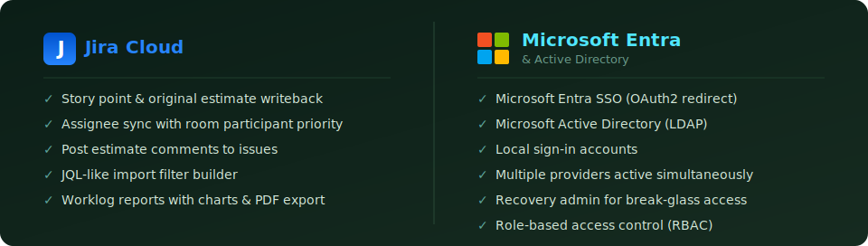
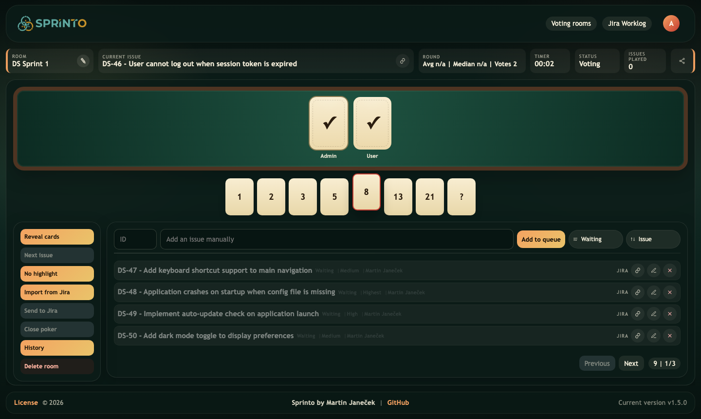
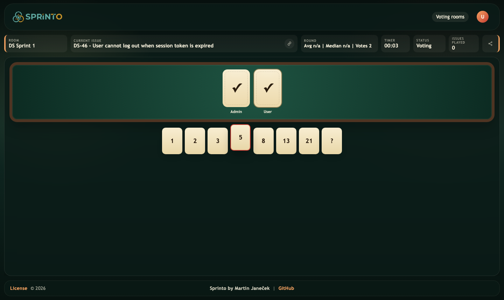
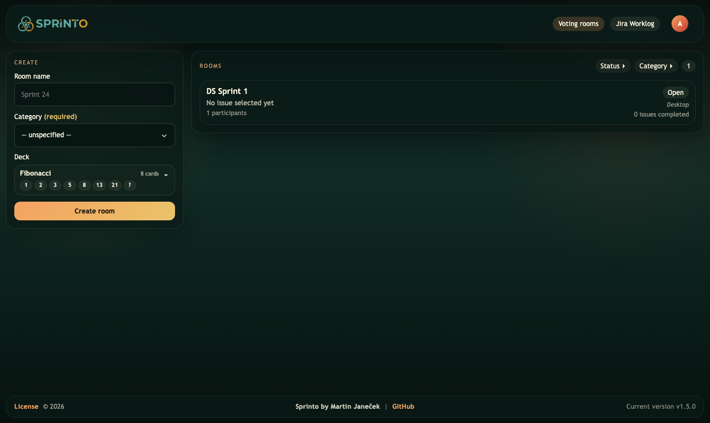
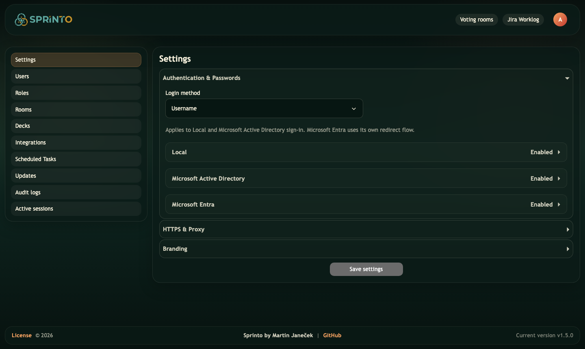
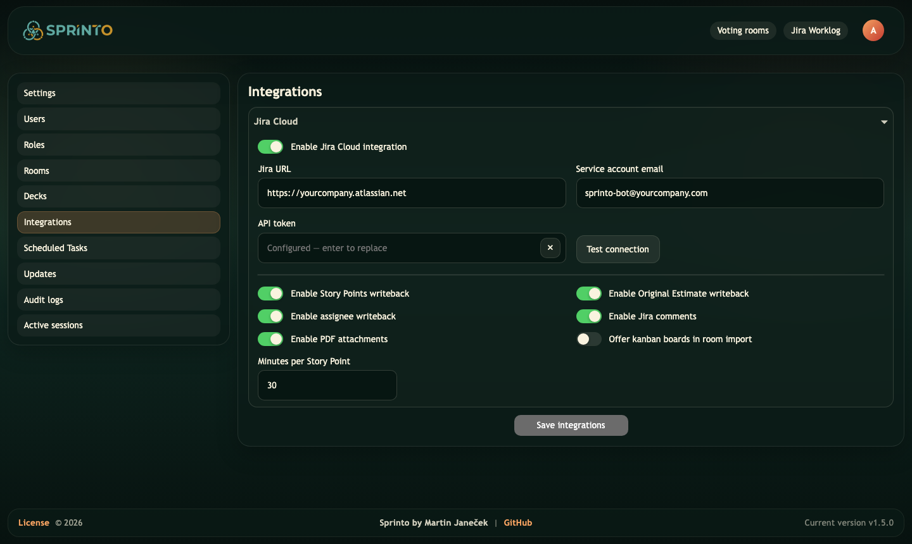
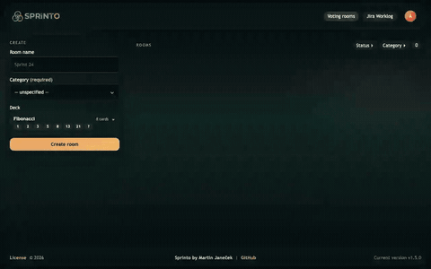
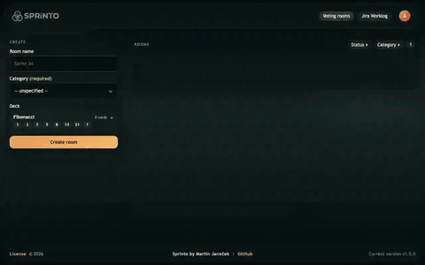
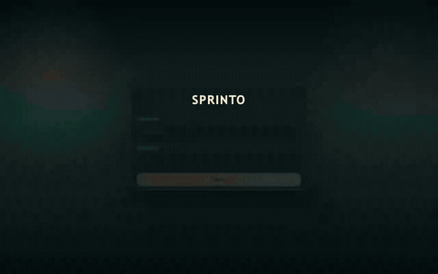
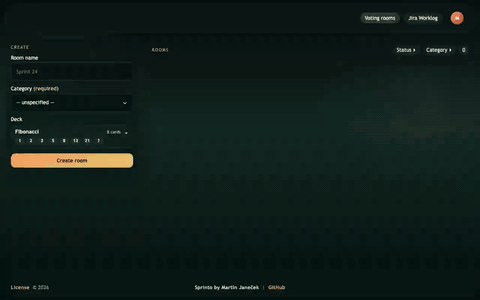

<p align="center">
  <br/>
  <a href="https://github.com/AlienPixl/Sprinto/releases/latest">
    
  </a>
  &nbsp;
  <a href="https://github.com/AlienPixl/Sprinto/actions/workflows/release-tests.yml">
    
  </a>
  &nbsp;
  <a href="LICENSE">
    
  </a>
  &nbsp;
  <a href="TRADEMARKS.md">
    
  </a>
  
</p>

Real-time planning poker that lives on your own server. Teams vote simultaneously — no anchoring, no waiting. Estimates go straight back to Jira with one click. Works with local accounts, Active Directory, and Microsoft Entra SSO out of the box.

- **Real-time voting** — simultaneous reveal, no anchoring bias
- **Jira Cloud** — import sprint backlog, push story points, post comments and PDF reports
- **Enterprise auth** — Active Directory LDAP and Microsoft Entra ID (OIDC) alongside local accounts
- **Vote history** — full timeline replay, scrub through who voted when
- **Role-based access** — built-in admin / master / user roles, fully customisable
- **Worklog reports** — Jira time-tracking aggregated by issue, user, or epic

<br>

<br>


## What it looks like


<p align="center"><em>Voting room — admin view with live results and controls</em></p>

<table>
  <tr>
    <td width="50%" align="center">
      
      <p><em>Participant view — card selection deck</em></p>
    </td>
    <td width="50%" align="center">
      
      <p><em>Dashboard — room list with status filters</em></p>
    </td>
  </tr>
  <tr>
    <td width="50%" align="center">
      
      <p><em>Authentication — local, Active Directory, and Entra ID side by side</em></p>
    </td>
    <td width="50%" align="center">
      
      <p><em>Jira Cloud — connect with a service account and API token</em></p>
    </td>
  </tr>
</table>

<table>
  <tr>
    <td width="50%" align="center">
      
      <p><em>Jira import — select board, sprint, apply JQL-like filters</em></p>
    </td>
    <td width="50%" align="center">
      
      <p><em>Vote history — scrub through the full timeline of who voted when</em></p>
    </td>
  </tr>
  <tr>
    <td width="50%" align="center">
      
      <p><em>Voting flow — cast votes, reveal simultaneously, push estimate to Jira</em></p>
    </td>
    <td width="50%" align="center">
      
      <p><em>Jira Worklog — time-tracking report grouped by issue, user, or epic</em></p>
    </td>
  </tr>
</table>


## Quick start

**Requirements:** Docker Engine 24+ and Docker Compose v2.

```bash
cp default.env.example .env
# open .env and set SPRINTO_RECOVERY_ADMIN_PASSWORD
docker compose up -d
# → http://localhost:3000
```


## Environment variables

### Core

| Variable | Default | Notes |
|---|---|---|
| `DATABASE_URL` | — | PostgreSQL connection string. The default `.env` points to the bundled service. |
| `PORT` | `3000` | Port the app listens on inside the container. |
| `SESSION_COOKIE_NAME` | `sprinto_session` | Cookie name. Change when running multiple instances on the same domain. |

### Bootstrap

| Variable | Default | Notes |
|---|---|---|
| `SPRINTO_SEED_DEMO_DATA` | `true` | Seed demo rooms and accounts (`admin/admin`, `master/master`, `user/user`) on first start. Set `false` for production. |
| `SPRINTO_RECOVERY_ADMIN_ENABLED` | `true` | Enable the break-glass admin account. |
| `SPRINTO_RECOVERY_ADMIN_USERNAME` | `sprinto-recovery` | Username for the break-glass account. |
| `SPRINTO_RECOVERY_ADMIN_PASSWORD` | — | **Set before first startup.** Store in a password manager. |
| `SPRINTO_RECOVERY_ADMIN_DISPLAY_NAME` | `System Recovery Admin` | Display name in UI and audit log. |

The recovery admin is recreated on every startup from these variables. To rotate the password — update `.env`, restart.

### Updates

| Variable | Default | Notes |
|---|---|---|
| `UPDATE_REPOSITORY` | `AlienPixl/Sprinto` | GitHub repo polled for new releases. Set to empty to disable (air-gapped environments). |

### Database TLS *(external PostgreSQL only)*

| Variable | Default | Notes |
|---|---|---|
| `SPRINTO_DB_SSL_ENABLED` | `false` | Enable TLS for the database connection. |
| `SPRINTO_DB_SSL_REJECT_UNAUTHORIZED` | `true` | Reject untrusted certificates. |
| `SPRINTO_DB_SSL_CA_FILE` | — | Path inside the container to a PEM CA certificate. |
| `SPRINTO_DB_SSL_CERT_FILE` | — | Client certificate for mutual TLS. |
| `SPRINTO_DB_SSL_KEY_FILE` | — | Client private key for mutual TLS. |

Mount certificates into the container and point the `*_FILE` variables to the mounted paths.


## License & Branding

Source-available under a custom license. Internal use, inspection, and non-commercial sharing are permitted. Selling, monetising, or hosting as a paid service is not. Public forks must preserve attribution and use different branding.

[LICENSE](LICENSE) · [NOTICE](NOTICE) · [TRADEMARKS.md](TRADEMARKS.md)
